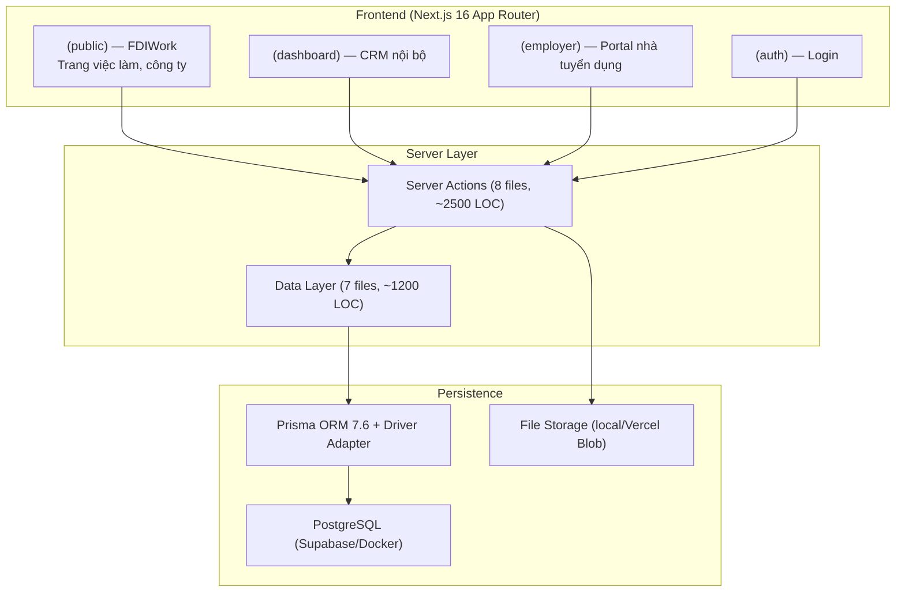
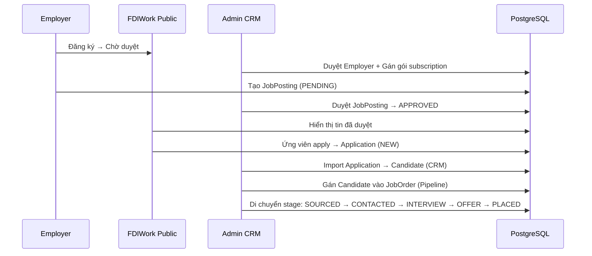

# 🔍 Headhunt Manager — Báo Cáo Kiểm Tra Kiến Trúc

> **Ngày:** 2026-04-02
> **Phạm vi:** Toàn bộ codebase (143 source files), bao gồm schema, server actions, data layer, auth, storage, routing.
> **Mục tiêu:** Đánh giá thực trạng kiến trúc, xác định rủi ro scale, và đề xuất fix thực tế.

---

## 1. Tổng Quan Kiến Trúc Hiện Tại

### 1.1 Stack & Cấu Trúc



### 1.2 Database Schema — 12 Models

| Nhóm | Models | Chức năng |
|------|--------|-----------|
| **CRM Core** | `User`, `Candidate`, `Client`, `JobOrder` | Quản lý ứng viên, khách hàng, tin tuyển dụng |
| **CRM Detail** | `CandidateNote`, `CandidateCV`, `CandidateLanguage`, `WorkExperience`, `CandidateTag`, `Tag` | Mở rộng thông tin ứng viên |
| **ATS Pipeline** | `JobCandidate` | Tracking ứng viên qua từng stage trong job |
| **FDIWork** | `Employer`, `Subscription`, `JobPosting`, `Application` | Portal nhà tuyển dụng công khai |

### 1.3 Hệ Thống Auth — Dual Layer

| Hệ thống | Công nghệ | Đối tượng | Cookie |
|-----------|-----------|-----------|--------|
| **CRM** | NextAuth v5 + Credentials + JWT | Admin/Member nội bộ | `next-auth.session-token` |
| **Employer** | Custom JWT (jose) + bcrypt-ts | Nhà tuyển dụng đăng ký | `employer-token` (7 ngày) |

### 1.4 Data Flow Chính



---

## 2. Các Vấn Đề Nghiêm Trọng (Xếp Theo Mức Độ)

### 🔴 P0 — Sẽ Gãy Ngay Khi Scale

#### 2.1 Tìm Kiếm Ứng Viên: Chỉ Dùng ILIKE — Không Thể Scale

**File:** [candidates.ts](file:///d:/MH/Headhunt_pj/src/lib/candidates.ts#L41-L85)

```typescript
// Hiện tại: search bằng ILIKE (contains + insensitive)
where.OR = [
  { fullName: { contains: s, mode: "insensitive" } },
  { phone: { contains: s, mode: "insensitive" } },
  { email: { contains: s, mode: "insensitive" } },
];
```

**Vấn đề:**
- `ILIKE '%keyword%'` = **full table scan** trên mọi record. Không index nào giúp được.
- 10K candidates: chấp nhận được (~50ms)
- 100K candidates: **chậm đáng kể** (~500ms+)
- 1M candidates: **không thể sử dụng** (>5 giây hoặc timeout)
- Tìm theo skills dùng `hasSome` trên `String[]` — cũng full scan.

**Tương tự ở:** [jobs.ts](file:///d:/MH/Headhunt_pj/src/lib/jobs.ts#L32-L47), [public-actions.ts](file:///d:/MH/Headhunt_pj/src/lib/public-actions.ts#L177-L187)

---

#### 2.2 Rate Limiting: In-Memory — Vô Dụng Trên Multi-Instance

**File:** [rate-limit.ts](file:///d:/MH/Headhunt_pj/src/lib/rate-limit.ts#L17-L27)

```typescript
const globalForRateLimit = globalThis as typeof globalThis & {
  __rateLimitStore?: Map<string, RateLimitEntry>;
};
```

**Vấn đề:**
- Store nằm trong memory process → **mất khi restart server** hoặc cold start (serverless).
- Vercel/serverless: mỗi request có thể chạy trên instance khác → rate limit **không hoạt động**.
- Memory leak tiềm ẩn: cleanup chỉ xảy ra khi có request mới (lazy), không có cron.

---

#### 2.3 Update Candidate Tags: Không Có Transaction

**File:** [candidates.ts](file:///d:/MH/Headhunt_pj/src/lib/candidates.ts#L158-L181)

```typescript
// 3 operations KHÔNG trong transaction:
const candidate = await prisma.candidate.update({ ... });      // 1. Update candidate
await prisma.candidateTag.deleteMany({ where: { candidateId: id } });  // 2. Xóa tags cũ
await prisma.candidateTag.createMany({ ... });                  // 3. Tạo tags mới
```

**Vấn đề:**
- Nếu step 2 thành công nhưng step 3 fail → **mất toàn bộ tags** của candidate.
- Comment trong code thừa nhận: *"Không dùng interactive $transaction vì gây lỗi P2028 với driver adapter"*.
- Đây là limitation của Prisma 7 driver adapter — cần workaround khác (sequential batch thay vì interactive).

---

### 🟠 P1 — Tech Debt Ẩn, Sẽ Gây Đau Khi Phát Triển Tiếp

#### 2.4 Inconsistent Skills Storage

| Model | Cách lưu | Ví dụ |
|-------|----------|-------|
| `Candidate.skills` | `String[]` (PostgreSQL array) | `["Java", "React", "SQL"]` |
| `JobPosting.skills` | `String?` (comma-separated) | `"Java, React, SQL"` |
| `JobOrder.requiredSkills` | `String[]` (PostgreSQL array) | `["Java", "React"]` |

**Hậu quả:**
- Không thể match candidate skills ↔ job skills chính xác.
- Phải parse string thành array mỗi lần so sánh.
- Không thể build tính năng "Auto-suggest matching candidates" hiệu quả.

---

#### 2.5 Không Có Audit Trail / Activity Log

**Vấn đề:**
- CRM cần biết **ai làm gì, khi nào** — hiện chỉ có `CandidateNote` (ghi chú thủ công).
- Không track: ai đổi status candidate, ai move pipeline stage, ai duyệt/reject job posting.
- Trong tuyển dụng, audit trail là yêu cầu nghiệp vụ cốt lõi (compliance, KPI, reporting).

---

#### 2.6 View Counter: Race Condition

**File:** [public-actions.ts](file:///d:/MH/Headhunt_pj/src/lib/public-actions.ts#L338-L340)

```typescript
// Fire-and-forget — không await, không kiểm tra lỗi
prisma.jobPosting
  .update({ where: { id: job.id }, data: { viewCount: { increment: 1 } } })
  .catch(() => {});
```

**Vấn đề:**
- `increment: 1` atomic ở DB level → OK cho race condition.
- Nhưng **fire-and-forget** nghĩa là: increment có thể fail silently (connection pool hết, DB overload).
- Ở scale cao → mỗi page view = 1 DB write → **write amplification** nghiêm trọng.
- Giải pháp: batch update hoặc Redis counter + periodic flush.

---

#### 2.7 Dashboard: 7 Parallel DB Queries, Không Cache

**File:** [dashboard/page.tsx](file:///d:/MH/Headhunt_pj/src/app/(dashboard)/dashboard/page.tsx#L11-L26)

```typescript
const [...] = await Promise.all([
  prisma.candidate.count(),            // 1
  prisma.client.count(...),            // 2
  prisma.jobOrder.count(...),          // 3
  getNewApplicationsCount(),           // 4 (thêm requireAdmin() bên trong)
  prisma.jobOrder.findMany(...),       // 5
  prisma.candidate.findMany(...),      // 6
  getRecentApplications(5),            // 7 (thêm requireAdmin() bên trong)
]);
```

**Vấn đề:**
- `getNewApplicationsCount()` và `getRecentApplications()` gọi `requireAdmin()` bên trong → **dư thừa 2 lần auth check** (trang dashboard đã protected bởi layout).
- 7 queries song song → connection pool stress. Mỗi tab refresh từ 5 users = 35 concurrent DB calls.
- `prisma.candidate.count()` không filter `isDeleted: false` → **đếm cả candidates đã xóa**.

---

#### 2.8 RBAC Quá Đơn Giản

**File:** [authz.ts](file:///d:/MH/Headhunt_pj/src/lib/authz.ts)

```typescript
// Chỉ có 2 level: ADMIN vs MEMBER
export async function requireAdmin() {
  if (session.user.role !== "ADMIN") redirect("/dashboard");
}
```

- `MEMBER` có thể: xem/sửa/xóa TẤT CẢ candidates, clients, jobs — không giới hạn theo ownership.
- Không có concept "assigned recruiter", "team lead", hoặc data visibility scope.
- Implications: một recruiter có thể xem/sửa dữ liệu của recruiter khác — vi phạm nguyên tắc least privilege.

---

### 🟡 P2 — Nên Fix Trong Roadmap Gần

#### 2.9 `getCurrentUserId()` Duplicate Ở 2 Nơi

**Files:** [actions.ts:L56-L60](file:///d:/MH/Headhunt_pj/src/lib/actions.ts#L56-L60), [job-actions.ts:L10-L14](file:///d:/MH/Headhunt_pj/src/lib/job-actions.ts#L10-L14)

```typescript
// Copy-paste y hệt ở 2 file khác nhau
async function getCurrentUserId(): Promise<number> {
  const session = await auth();
  if (!session?.user?.id) throw new Error("Unauthorized");
  return Number(session.user.id);
}
```

- Ditto cho `enumVal()`, `strVal()` — duplicate ở ít nhất 3 files.

---

#### 2.10 Candidate Email Không Unique

**Schema:** `Candidate.email` là `String?` — không có `@unique`.

**Hậu quả:**
- Import application tìm candidate bằng `findFirst({ where: { email } })` → **nếu có 2 candidates trùng email, link vào candidate sai**.
- Không thể đảm bảo deduplication khi bulk import.

---

#### 2.11 Soft Delete Không Nhất Quán

| Entity | Soft/Hard Delete | Filter ở data layer? |
|--------|-----------------|---------------------|
| `Candidate` | Soft (`isDeleted`) | ✅ Có filter |
| `Client` | Soft (`isDeleted`) | ✅ Có filter |
| `JobOrder` | ❌ Không có soft delete | N/A |
| `CandidateNote` | Hard delete (cascade) | N/A |
| `Application` | ❌ Không có delete | N/A |
| `Employer` | ❌ Không có delete | N/A |

- Dashboard `candidate.count()` — **không filter `isDeleted`** → đếm sai.
- Soft-deleted candidates vẫn có thể hiện trong `JobCandidate` pipeline.

---

#### 2.12 Không Có Input Validation Library

- Toàn bộ validation bằng if/else thủ công trong server actions.
- Không dùng Zod hay bất kỳ schema validation nào (dù Zod đã có trong `node_modules`).
- `enumVal<T>(value)` cast `as T` — **không type-safe**, accept bất kỳ string nào.

---

#### 2.13 Zero Test Coverage

- **Không có test file nào** trong project (tất cả `.test.*` đều thuộc `node_modules`).
- Không có CI/CD pipeline config.
- Refactor bất kỳ thứ gì = mò mẫm + manual testing.

---

## 3. Đánh Giá Functional Requirements

### 3.1 Fast Candidate Search (Skills, Filters)

| Tiêu chí | Trạng thái | Chi tiết |
|-----------|-----------|----------|
| Text search (tên, email, phone) | ⚠️ ILIKE only | Chậm >50K records |
| Filter theo status, level, location | ✅ Có index | Hoạt động tốt |
| Filter theo skills | ⚠️ `hasSome` trên `String[]` | Không index, full scan |
| Filter theo language | ✅ Relation query | Có index trên `CandidateLanguage.language` |
| Filter theo salary range | ✅ Range query | OK |
| Filter theo tags | ✅ Relation query | OK |
| Combined search (AND nhiều filter) | ⚠️ Kết hợp | Mỗi filter thêm chậm hơn |
| Full-text search | ❌ Không có | Không tìm được "senior java developer" trong ghi chú hoặc CV |

**Kết luận:** Search cơ bản hoạt động ở scale nhỏ (<10K). Sẽ gãy ở 100K+.

### 3.2 CRM — Interaction Tracking

| Tiêu chí | Trạng thái | Chi tiết |
|-----------|-----------|----------|
| Ghi chú trên candidate | ✅ | `CandidateNote` — ai tạo, khi nào |
| Track source/nguồn | ✅ | `CandidateSource` enum + sourceDetail |
| Track history thay đổi | ❌ | Không có audit log |
| Track emails/calls | ❌ | Không có integration |
| Track reminders/tasks | ❌ | Không có task/reminder model |
| Client contact management | ✅ | `ClientContact` model |
| Revenue/billing tracking | ⚠️ Partial | Có `fee`/`feeType` trên JobOrder nhưng không có revenue report |

**Kết luận:** CRM rất cơ bản — chỉ có ghi chú thủ công, thiếu automation và tracking tự động.

### 3.3 ATS — Pipeline Tracking

| Tiêu chí | Trạng thái | Chi tiết |
|-----------|-----------|----------|
| Pipeline stages | ✅ | 6 stages: SOURCED → PLACED |
| Stage transition | ✅ | `updateCandidateStageAction` |
| Submission result | ✅ | `SubmissionResult` (PENDING/HIRED/REJECTED/WITHDRAWN) |
| Interview scheduling | ⚠️ Basic | Chỉ có `interviewDate` — không có calendar integration |
| Pipeline notes | ✅ | `notes` trên `JobCandidate` |
| Stage history/timeline | ❌ | Chỉ lưu stage hiện tại, không lưu lịch sử chuyển đổi |
| Kanban view | ⚠️ | `job-pipeline.tsx` component — nhóm theo stage |
| Bulk actions | ❌ | Không có batch move/reject |
| Email automation | ❌ | Không có email integration |

**Kết luận:** ATS pipeline cơ bản hoạt động cho quy trình đơn giản. Thiếu timeline, history, automation.

---

## 4. Kịch Bản "Cái Gì Sẽ Gãy Trước?"

### Kịch bản 1: 10K → 50K Candidates
**Gãy đầu tiên:** Search ứng viên. CRM users bắt đầu phàn nàn search chậm khi tìm kiếm tổng hợp (name + skill + location). Dashboard count queries cũng chậm dần.

### Kịch bản 2: 100+ Hiring Managers Dùng Đồng Thời
**Gãy đầu tiên:** Connection pool exhaustion. Dashboard 7 parallel queries × 100 users = 700 concurrent connections tới Supabase (free tier: 42 direct connections).

### Kịch bản 3: 1000+ Job Postings Active
**Gãy đầu tiên:** View counter write amplification. Mỗi page view = 1 DB write. 10K views/ngày = 10K unnecessary writes → ảnh hưởng toàn bộ DB performance.

### Kịch bản 4: 2+ Server Workers/Instances
**Gãy đầu tiên:** Rate limiting hoàn toàn vô dụng. Brute force attack trên `/employer/login` sẽ bypass giới hạn 5 lần thử.

### Kịch bản 5: Recruiter Team Mở Rộng (5+ Người)
**Gãy đầu tiên:** Data isolation. Recruiter A thấy/sửa toàn bộ candidates của Recruiter B. Không có ownership concept → xung đột dữ liệu.

---

## 5. Đề Xuất Fix (Thực Tế, Ít Rewrite)

### Nhóm 1 — Quick Wins (1-3 ngày mỗi item)

| # | Fix | Effort | Impact |
|---|-----|--------|--------|
| 1 | **Thêm `@@index` GIN cho `Candidate.skills`** — `CREATE INDEX ... USING GIN (skills)` trên PostgreSQL | 30 phút | Tìm kiếm theo skills nhanh x10 |
| 2 | **Fix dashboard count** — thêm `{ isDeleted: false }` vào `candidate.count()` | 5 phút | Đếm chính xác |
| 3 | **Extract shared utils** — move `getCurrentUserId()`, `enumVal()`, `strVal()` ra 1 file chung | 1 giờ | Giảm duplicate code |
| 4 | **Dùng `$transaction` batch** (không interactive) cho tag update | 1 giờ | Fix data integrity |
| 5 | **Unify skills format** — migrate `JobPosting.skills` từ `String?` → `String[]` | 2 giờ + migration | Consistent data model |

### Nhóm 2 — Medium Effort (1-2 tuần)

| # | Fix | Effort | Impact |
|---|-----|--------|--------|
| 6 | **PostgreSQL Full-Text Search** — thêm `tsvector` column trên Candidate + GIN index | 3 ngày | Search nhanh ở 100K+ records |
| 7 | **Redis rate limiting** — Upstash Redis (free tier) thay in-memory store | 1 ngày | Rate limit hoạt động đúng trên serverless |
| 8 | **Activity Log model** — `AuditLog { userId, action, entity, entityId, metadata, createdAt }` | 3 ngày | CRM audit trail + KPI tracking |
| 9 | **Zod validation** — replace toàn bộ if/else validation bằng Zod schemas | 3 ngày | Type-safe input, reusable schemas |
| 10 | **Basic test suite** — Vitest + test cho critical paths (create candidate, pipeline move, import) | 5 ngày | Safety net cho refactor |

### Nhóm 3 — Strategic (1+ tháng)

| # | Fix | Effort | Impact |
|---|-----|--------|--------|
| 11 | **RBAC nâng cao** — thêm `TeamId`, ownership concept, data scope | 2 tuần | Multi-recruiter team safety |
| 12 | **View counter optimization** — Redis atomic increment + cron flush to DB | 1 tuần | Giảm 99% DB writes cho public pages |
| 13 | **Candidate deduplication** — unique constraint trên email/phone + merge flow | 2 tuần | Clean data, prevent duplicates |
| 14 | **Pipeline stage history** — `StageTransition { from, to, changedBy, changedAt }` | 1 tuần | ATS timeline tracking |
| 15 | **Elasticsearch/Meilisearch** — external search engine cho full-text + faceted search | 3 tuần | Scale tới 1M+ candidates |

---

## 6. Tóm Tắt — Priority Matrix

```
              IMPACT CAO
                  │
    ┌─────────────┼─────────────┐
    │  FIX NGAY   │   PLAN NÓ   │
    │  #1,2,3,4   │  #6,7,8,11  │
    │  (1-3 ngày) │  (1-4 tuần) │
    │             │             │
────┼─────────────┼─────────────┼── EFFORT
    │             │             │
    │  BACKLOG    │   SAU CÙNG  │
    │  #5,9,10    │  #12,13,14  │
    │             │  15         │
    └─────────────┼─────────────┘
                  │
              IMPACT THẤP
```

> [!CAUTION]
> Vấn đề **#1 (ILIKE search)** và **#4 (non-transactional tags)** là 2 bom nổ chậm. #1 sẽ gãy chắc chắn khi đạt 50K candidates. #4 đã từng có thể gây mất data nếu có lỗi mạng đúng thời điểm delete/create tags.

> [!TIP]
> Fix ưu tiên nhất: **#1, #2, #4** — tổng cộng dưới 1 ngày effort, giải quyết 3 vấn đề data integrity + performance nghiêm trọng nhất.
