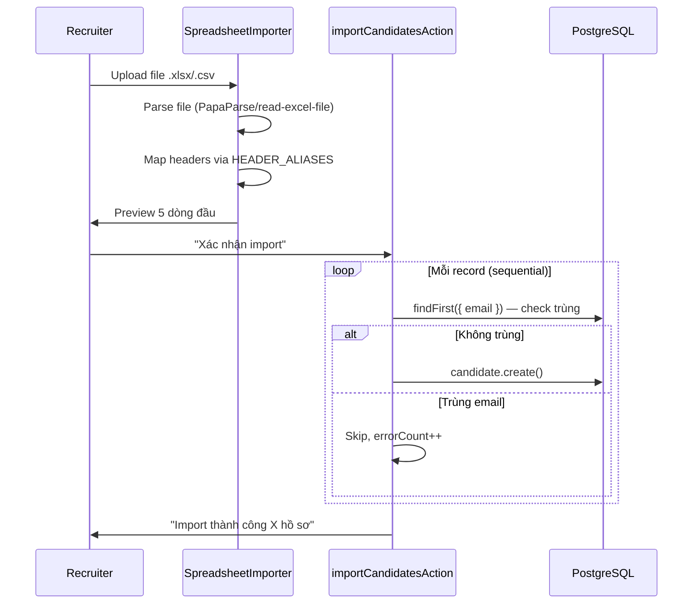

# 🎯 Headhunt Manager — Audit Flow Recruiter (Phần 2: Supporting Flows)

> **Tiếp nối** [recruiter_journey_audit.md](file:///C:/Users/Admin/.gemini/antigravity/brain/50223018-cf44-4546-a4ea-97e5f1e13719/recruiter_journey_audit.md) — phần core flow.
> **Phạm vi:** Candidate detail management, bulk import, admin moderation, client management.

---

## Flow A: Quản Lý Hồ Sơ Ứng Viên Chi Tiết

### Layout trang `/candidates/{id}`

```
┌──────────────────────────────────┬──────────────────────────┐
│ ← Quay lại    Nguyễn Văn A #42  │                          │
│               Tạo 01/03 bởi Admin│  [Sẵn sàng ▼]  [Sửa] [Xóa]│
├──────────────────────────────────┼──────────────────────────┤
│  ┌── Thông tin liên hệ ───────┐ │                          │
│  │ [Avatar]  Nguyễn Văn A      │ │  ┌── Xem trước CV ────┐ │
│  │ Nguồn: LinkedIn             │ │  │                      │ │
│  │ ☎ 0912345678               │ │  │  [PDF iframe]        │ │
│  │ ✉ a@email.com              │ │  │                      │ │
│  │ 📅 01/01/1990 • Nam         │ │  │  resizable (250-1200)│ │
│  │ 📍 TP.HCM                  │ │  │                      │ │
│  └─────────────────────────────┘ │  │  [Phóng to] [Mở tab]│ │
│  ┌── Nghề nghiệp ─────────────┐ │  └──────────────────────┘ │
│  │ 💼 Backend Developer        │ │                          │
│  │ 🏢 ABC Corp                 │ │                          │
│  │ IT / 5 năm                  │ │                          │
│  │ 💰 Hiện: 20tr / KV: 30tr   │ │                          │
│  │ 🏷️ SENIOR                  │ │                          │
│  │ Skills: [Node.js] [React]   │ │                          │
│  └─────────────────────────────┘ │                          │
│                                  │                          │
│  ┌── Tabs ─────────────────────┐ │                          │
│  │ [CV] [Ngôn ngữ] [Kinh nghiệm]│                          │
│  │  (CRUD forms for each)      │ │                          │
│  └─────────────────────────────┘ │                          │
│                                  │                          │
│  ┌── Tags ─────────────────────┐ │                          │
│  │ [Hot] [Priority] [+Tag]     │ │                          │
│  └─────────────────────────────┘ │                          │
│                                  │                          │
│  ┌── Ghi chú ──────────────────┐ │                          │
│  │ Admin: "Đã gọi, hẹn PV..." │ │                          │
│  │ [Thêm ghi chú ___] [Gửi]  │ │                          │
│  └─────────────────────────────┘ │                          │
└──────────────────────────────────┴──────────────────────────┘
```

### Pain Points — Candidate Detail

| # | Vấn đề | Mức độ | Chi tiết |
|---|--------|--------|----------|
| **A1** | **Không hiện candidate đang ở job nào** | 🔴 Critical | Trang detail **không truy vấn `JobCandidate`**. Recruiter không biết UV này đang ở pipeline nào, stage nào. Phải vào từng job để kiểm tra → cực kỳ tốn thời gian. Schema có `jobLinks` relation nhưng **không được include** trong `getCandidateById()`. |
| **A2** | **CV viewer chỉ render PDF** | 🟠 High | Component dùng `<iframe src={cvUrl}>`. PDF hiển thị OK nhưng **.doc/.docx không render được** trong iframe trên hầu hết browser. Recruiter upload Word → thấy trang trắng hoặc download prompt. |
| **A3** | **Status change không có guard** | 🟡 Medium | Dropdown status thay đổi ngay lập tức khi select (no confirm). Chuyển nhầm từ AVAILABLE → BLACKLIST = UV biến mất khỏi search filter mặc định. Không có undo. |
| **A4** | **Delete candidate = soft delete nhưng không recoverable qua UI** | 🟡 Medium | `softDeleteCandidate()` set `isDeleted: true` + redirect. Nhưng **không có UI để admin khôi phục** (undelete). Confirm dialog nói "có thể khôi phục bởi Admin" nhưng không có trang nào list deleted candidates. |
| **A5** | **Không có duplicate detection khi xem profile** | 🟡 Medium | Xem profile "Nguyễn Văn A" — không biết có "Nguyen Van A" khác hay UV trùng email/phone. Phải tự search thủ công. |

---

## Flow B: Import Dữ Liệu Hàng Loạt (Spreadsheet)

### Flow thực tế

```
/import → SpreadsheetImporter → parse CSV/XLSX → preview 5 rows → importCandidatesAction
```

### Cơ chế hoạt động



### Pain Points — Import

| # | Vấn đề | Mức độ | Chi tiết |
|---|--------|--------|----------|
| **B1** | **Sequential creates — N+1 pattern** | 🔴 Critical | [import-actions.ts:L17-L48](file:///d:/MH/Headhunt_pj/src/lib/import-actions.ts#L17-L48): import 500 records = **1000 DB queries** (500 findFirst + 500 create, tuần tự). 1000 records ≈ 30-60 giây. Không có `createMany` hay batch. |
| **B2** | **Không import được skills, salary, level, years of experience** | 🔴 Critical | `CandidateImportRow` chỉ có 7 fields: `fullName, email, phone, location, industry, currentPosition, currentCompany`. Những thông tin quan trọng nhất cho matching (skills, salary, level) **bị bỏ qua**. Import xong → phải vào từng profile thêm skills thủ công. |
| **B3** | **Dedup chỉ check email, không check phone** | 🟠 High | Nếu candidate không có email nhưng trùng phone → **tạo duplicate**. Trong thực tế recruitment VN, nhiều UV chỉ có SĐT. |
| **B4** | **Không có rollback khi import fails giữa chừng** | 🟠 High | Import 500 records, fail ở record 300 → 299 records đã create, 201 bị bỏ. **Không có transaction bao ngoài**. Không biết record nào đã import, record nào chưa. |
| **B5** | **Preview chỉ hiện 5 dòng** | 🟡 Medium | File 1000 dòng → recruiter chỉ thấy 5 → nhấn import. Nếu mapping sai từ dòng 6 → không phát hiện. Không có option kiểm tra toàn bộ. |
| **B6** | **Không có error report chi tiết** | 🟡 Medium | Sau import → chỉ hiện `"Cập nhật thành công X hồ sơ"`. Không biết **record nào bị skip** (trùng email/thiếu tên), lý do gì. Không export danh sách lỗi. |
| **B7** | **Header alias nhận dạng thiếu** | 🟡 Medium | Aliases cho `fullName`: `["ho ten", "ten", "name", "ho va ten"]`. Nếu file Excel dùng "Họ và Tên" (có dấu) → `normalizeHeader()` strip dấu thành "ho va ten" → OK. Nhưng "Tên đầy đủ" hay "Full Name" (có space) **không khớp** vì alias "full name" match "fullname" nhưng header normalize thành "full name" → `includes("full name")` → OK. Nhưng edge case nhiều. |

### Query performance khi import

```
500 candidates:
  findFirst × 500 = 500 queries (~150ms each) = ~75 giây
  create × 500 = 500 queries (~50ms each) = ~25 giây
  TỔNG: ~100 giây ← UNACCEPTABLE

Nếu dùng createMany + batch dedup:
  1 findMany(emails) = 1 query (~20ms)
  1 createMany = 1 query (~200ms)
  TỔNG: ~0.22 giây ← 450x nhanh hơn
```

---

## Flow C: Admin Moderation Pipeline

### Flow tổng quan

```
Employer đăng ký → (PENDING) → Admin duyệt → (ACTIVE)
                                                  ↓
Employer tạo JobPosting → (PENDING) → Admin duyệt → (APPROVED) → Hiển thị trên FDIWork
                                                                        ↓
Ứng viên apply qua web → Application (NEW) → Admin review → Import vào CRM Candidate
```

### Moderation flow chi tiết

```
/moderation → Tab "Tin tuyển dụng" + Tab "Nhà tuyển dụng"
  ├── Tin tuyển dụng:
  │   - Filter: PENDING / ALL
  │   - Actions: [Duyệt] [Từ chối + lý do]
  │   - Khi duyệt: set publishedAt, expiresAt (từ subscription.jobDuration)
  │
/moderation/applications → Tab "Đơn ứng tuyển"
  │   - Filter: NEW / REVIEWED / SHORTLISTED / ALL
  │   - Actions: [Import vào CRM]
  │   - Import: tìm candidate trùng email → link / tạo mới
  │
/employers → Quản lý nhà tuyển dụng
  │   - Actions: [Duyệt] [Khóa] [Link Client] [Gán gói]
  │   - Edit: sửa thông tin công ty, upload logo
  │
/packages → Quản lý gói dịch vụ
      - Assign subscription cho employer
      - Config: tier, quota, duration, showLogo, showBanner
```

### Pain Points — Admin Moderation

| # | Vấn đề | Mức độ | Chi tiết |
|---|--------|--------|----------|
| **C1** | **Import application không link vào JobOrder tương ứng** | 🔴 Critical | `importApplicationToCRM()` tạo Candidate từ Application nhưng **không tự động link vào pipeline** của JobOrder liên quan. Recruiter phải thủ công vào job → assign candidate. Vì `Application.jobPosting` có thể trỏ tới `JobPosting.jobOrderId` → lẽ ra auto-assign nếu link exists. |
| **C2** | **Approve job posting không validate nội dung** | 🟡 Medium | Admin click "Duyệt" → set APPROVED ngay. Không có preview nội dung, không check required fields (title/description đã có, nhưng salary/location/industry có thể null → tin tuyển dụng trống trên public site). |
| **C3** | **Subscription quản lý thủ công** | 🟡 Medium | `assignSubscription()` set endDate bằng `durationMonths × 30 ngày` — **không có auto-expire**. Khi hết hạn, employer vẫn có thể access portal (JWT không embed expiry check cho subscription). |
| **C4** | **Không có notification system** | 🟠 High | Employer tạo tin → chờ admin duyệt. Admin duyệt → employer không biết. Ứng viên apply → employer không nhận email. Tất cả phải **tự F5 kiểm tra**. |

---

## Flow D: Quản Lý Client (Doanh Nghiệp Khách Hàng)

### Flow thực tế

```
/clients → danh sách + filter (search, industry, size)
/clients/new → form tạo client
/clients/{id} → detail + contacts + job orders count
```

### Pain Points — Client Management

| # | Vấn đề | Mức độ | Chi tiết |
|---|--------|--------|----------|
| **D1** | **Client detail không hiện danh sách JobOrders** | 🟠 High | `CLIENT_DETAIL_INCLUDE` chỉ include `_count: { jobOrders: true }` — hiện **số lượng** nhưng không list ra. Recruiter xem client → biết "có 5 jobs" nhưng không biết job nào, phải qua `/jobs` filter theo client. |
| **D2** | **Client-Employer link là manual** | 🟡 Medium | Admin phải vào `/employers/{id}` → chọn Client từ dropdown → link thủ công. Không có auto-suggest khi tên company trùng. |
| **D3** | **Không có revenue tracking** | 🟠 High | Client có JobOrder với `fee`/`feeType` nhưng **không aggregate** tổng revenue, not-yet-billed, etc. Cho business owner, đây là tính năng quan trọng nhất. |
| **D4** | **Contact management rất cơ bản** | 🟡 Medium | `ClientContact` chỉ có name/position/phone/email/isPrimary. Không có: preferred contact method, last contacted date, communication log. |

---

## Tổng Hợp: Ma Trận Rủi Ro Theo Flow

| Flow | Friction Score | Sẽ Gãy Ở | Root Cause Chính |
|------|---------------|-----------|------------------|
| **A. Candidate Detail** | ████░░ HIGH | Currently broken | Thiếu job pipeline view |
| **B. Spreadsheet Import** | █████░ CRITICAL | >100 records | Sequential N+1, thiếu fields |
| **C. Admin Moderation** | ███░░░ MEDIUM | Khi scale >20 employers | Manual everything, no notifications |
| **D. Client Management** | ████░░ HIGH | Khi cần báo cáo | Thiếu revenue, thiếu job list |

---

## Phát Hiện Cross-Flow: Disconnected Data Islands

Một vấn đề xuyên suốt mà từng flow riêng lẻ không thể thấy:

```
                    CRM WORLD                    │              FDIWORK WORLD
                                                 │
  Candidate ──── JobCandidate ──── JobOrder ──── Client   │   Employer ──── JobPosting ──── Application
       │              │              │            │   │        │              │              │
       │         (pipeline)     (job nội bộ)      │   │   (công ty)     (tin đăng)      (đơn apply)
       │              │              │            │   │        │              │              │
       │              │         ┌────┘            │   │   ┌────┘              │              │
       │              │         │  optional link  │   │   │ optional link     │              │
       │              │         │  (admin manual) │   │   │ (admin manual)    │              │
       │              │         └────────────────────────┘                    │              │  
       │              │                           │                          │              │
       └──────────────┤                           │                     ┌────┘              │
                      │                           │                     │ optional link      │
                      │                           │                     │ (admin manual)     │
                      │                           │                     │                    │
                      └───────────────────────────│─────────────────────┘                    │
                                                  │                                         │
                                                  │     Application.candidateId              │
                                                  │     (set khi import)                     │
                                                  │─────────────────────────────────────────│
```

**Vấn đề:**
- **3 manual links** cần admin thao tác tay: `Employer ↔ Client`, `JobPosting ↔ JobOrder`, `Application → Candidate`.
- Nếu **bất kỳ link nào thiếu** → 2 thế giới bị disconnect. Ví dụ: Employer đăng tin, UV apply → nhưng Client/JobOrder trong CRM không biết.
- **Không có auto-detect** khi company name trùng giữa Employer và Client.
- **Hậu quả thực tế:** Recruiter có 2 bộ dữ liệu rời rạc. Job tuyển bên CRM ≠ tin đăng bên FDIWork. Phải đối chiếu thủ công. Sai sót xảy ra ở quy mô 50+ employers/clients.

---

## Đề Xuất Bổ Sung (Từ Audit Supporting Flows)

| Ưu tiên | Fix | Impact | Effort |
|---------|-----|--------|--------|
| 🔴 1 | **Show job pipelines trên candidate detail** — include `jobLinks` trong `getCandidateById()`, render danh sách jobs + stage | Recruiter thấy UV đang ở đâu | 3h |
| 🔴 2 | **Batch import** — thay `for..of` bằng `createMany` + batch dedup | Import 500 records: 100s → 0.2s | 4h |
| 🔴 3 | **Thêm skills/salary/level vào import** — mở rộng `CandidateImportRow` + header aliases | Data import đầy đủ | 2h |
| 🟠 4 | **Auto-link Application → JobCandidate** khi import — nếu `JobPosting.jobOrderId` exists, tạo `JobCandidate` luôn | Reduce 1 manual step per import | 2h |
| 🟠 5 | **Client detail show job list** — include `jobOrders` với status/title trong `getClientById()` | Client overview đầy đủ | 1h |
| 🟠 6 | **CV viewer: Google Docs Viewer fallback** cho .doc/.docx — `https://docs.google.com/gview?url=` | Word files hiển thị được | 1h |
| 🟡 7 | **Import error report** — trả danh sách `{ row, reason }` cho records bị skip | Recruiter biết fix data gì | 2h |
| 🟡 8 | **Trash/Archive view** — trang `/candidates/trash` list `isDeleted: true`, cho phép restore | Data recoverable qua UI | 3h |

> [!IMPORTANT]
> Fix **#1 (job pipelines trên candidate detail)** nên làm đầu tiên — đây là friction lớn nhất cross-flow. Recruiter mở profile UV → PHẢI biết UV đang ở pipeline nào. Thiếu tính năng này, toàn bộ ATS tracking workflow bị đứt gãy khi nhìn từ góc candidate.
