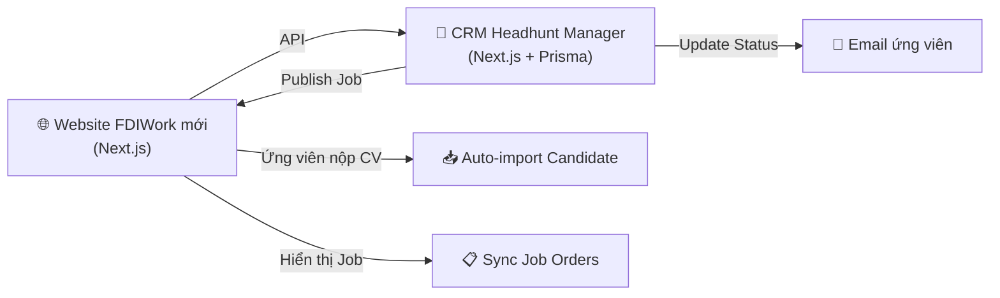

# 📊 BÁO CÁO ĐÁNH GIÁ WEBSITE FDIWORK.COM

**Ngày đánh giá:** 2026-03-21  
**URL:** https://www.fdiwork.com/  
**Mục đích:** Đánh giá toàn diện UI/UX và tính năng website hiện tại, làm cơ sở để build lại & tích hợp CRM Headhunt Manager

---

## 1. TỔNG QUAN WEBSITE

| Tiêu chí | Chi tiết |
|----------|---------|
| **Loại website** | Job Board (Trang tuyển dụng) |
| **Ngôn ngữ** | Tiếng Việt |
| **Đối tượng** | Ứng viên tìm việc tại các công ty FDI |
| **Số trang chính** | 5 trang |
| **Số lượng việc làm** | ~490 (49 trang x 10 jobs/trang) |
| **SEO Title** | "Tìm việc làm nhanh, tuyển dụng hiệu quả" |

---

## 2. CẤU TRÚC WEBSITE (SITEMAP)

```
fdiwork.com/
├── Trang chủ (/)
├── Việc làm tốt nhất (/viec-lam-tot-nhat)
├── Việc làm gợi ý (/viec-lam-goi-y)
├── Công ty hàng đầu (/cong-ty-hang-dau)
├── Thông tin chia sẻ (/tin-tuc)
├── Chi tiết việc làm (/viec-lam/{slug})
└── Chi tiết công ty (/cong-ty/{slug})
```

---

## 3. ĐÁNH GIÁ GIAO DIỆN (UI/UX)

### 3.1. Thiết kế tổng thể

| Hạng mục | Đánh giá | Điểm (1-10) |
|----------|---------|:---:|
| **Phong cách thiết kế** | Lỗi thời, giống web 2015-2018. Gradient cũ, đổ bóng nặng | **3** |
| **Bảng màu** | Xanh dương chủ đạo, thiếu nhất quán | **4** |
| **Typography** | Font mặc định, chưa dùng Google Fonts hiện đại | **3** |
| **Responsive** | Có hỗ trợ mobile nhưng chưa tối ưu | **4** |
| **Hình ảnh** | Banner AI/stock chưa qua xử lý chuyên nghiệp | **3** |
| **Animations** | Hầu như không có hiệu ứng chuyển động | **2** |
| **Trải nghiệm tổng thể** | Cảm giác cũ, không chuyên nghiệp cho thương hiệu FDI | **3** |

> **Điểm trung bình UI: 3.1/10** ⚠️

### 3.2. Vấn đề UX nghiêm trọng

> [!CAUTION]
> **Menu hamburger trên Desktop** — Đây là lỗi UX nghiêm trọng nhất. Navigation menu bị ẩn trong biểu tượng ☰ ngay cả trên màn hình lớn, khiến người dùng phải click thêm 1 bước mới thấy các trang.

> [!WARNING]
> **Homepage thiếu nội dung** — Trang chủ chỉ hiển thị banner tìm kiếm lớn + logo công ty đối tác. Không có "Việc làm mới nhất", "Việc làm lương cao", hay "Ngành tuyển dụng hot" — những thông tin mà ứng viên cần thấy ngay.

**Các vấn đề UX khác:**
- ❌ Không có breadcrumb navigation rõ ràng
- ❌ Bộ lọc nâng cao ở sidebar nhưng UI chưa trực quan
- ❌ Không có call-to-action (CTA) mạnh trên trang chủ
- ❌ Footer lặp lại link trùng với menu chính
- ❌ Không có thanh tìm kiếm nổi bật
- ❌ Thiếu chỉ báo loading khi lọc/tìm kiếm

---

## 4. ĐÁNH GIÁ TÍNH NĂNG

### 4.1. Các tính năng hiện có

| # | Tính năng | Mô tả | Đánh giá |
|---|----------|-------|---------|
| 1 | **Danh sách việc làm** | Hiển thị theo trang (10/12/20 items), có phân trang | ⭐⭐⭐ |
| 2 | **Lọc nâng cao** | Lọc theo: Ngành nghề, Vị trí, Khu vực | ⭐⭐⭐ |
| 3 | **Sắp xếp** | Mới nhất / Cũ nhất | ⭐⭐ |
| 4 | **Chi tiết việc làm** | Mô tả, Yêu cầu, Phúc lợi, Nộp CV | ⭐⭐⭐ |
| 5 | **Nộp CV (Form popup)** | Form gửi CV trực tiếp | ⭐⭐⭐ |
| 6 | **Danh sách công ty** | Profile công ty + số lượng việc đang tuyển | ⭐⭐ |
| 7 | **Blog/Tin tức** | Bài viết chia sẻ (chỉ ~2 bài) | ⭐ |
| 8 | **Phân trang** | Pagination chuẩn | ⭐⭐ |

### 4.2. Danh sách ngành nghề có sẵn

Website hiện hỗ trợ 16 ngành nghề:

| # | Ngành nghề |
|---|-----------|
| 1 | Công nghệ thông tin (IT - Software) |
| 2 | Marketing - Truyền thông - Quảng cáo |
| 3 | Sản xuất - Kỹ thuật - Cơ khí |
| 4 | Hành chính - Nhân sự |
| 5 | Kinh doanh - Bán hàng |
| 6 | Kế toán - Tài chính - Ngân hàng |
| 7 | Logistics - Chuỗi cung ứng - Xuất nhập khẩu |
| 8 | Nhà hàng - Khách sạn - Du lịch |
| 9 | Bất động sản |
| 10 | Thiết kế - Kiến trúc - Nội thất |
| 11 | Luật - Pháp lý |
| 12 | Vận tải - Lái xe |
| 13 | Bảo vệ - An ninh |
| 14 | Giáo dục - Đào tạo |
| 15 | Y tế - Dược |
| 16 | Lao động phổ thông |

### 4.3. Tính năng THIẾU (cần có cho web tuyển dụng hiện đại)

| # | Tính năng thiếu | Mức độ quan trọng |
|---|-----------------|:-:|
| 1 | Đăng ký/Đăng nhập ứng viên | 🔴 Cao |
| 2 | Tạo profile ứng viên online | 🔴 Cao |
| 3 | Tìm kiếm theo từ khóa | 🔴 Cao |
| 4 | Lưu việc làm yêu thích | 🟡 Trung bình |
| 5 | Đăng ký nhận thông báo việc mới | 🟡 Trung bình |
| 6 | So sánh việc làm | 🟢 Thấp |
| 7 | Đánh giá công ty | 🟡 Trung bình |
| 8 | Bản đồ vị trí công ty | 🟢 Thấp |
| 9 | Multi-language (Anh/Hàn/Nhật/Trung) | 🟡 Trung bình |
| 10 | Mobile App hoặc PWA | 🟡 Trung bình |
| 11 | Admin panel quản lý nội dung | 🔴 Cao |
| 12 | Analytics & báo cáo | 🔴 Cao |
| 13 | API tích hợp CRM | 🔴 Cao |

---

## 5. ĐÁNH GIÁ KỸ THUẬT

### 5.1. Công nghệ hiện tại (ước đoán)

| Hạng mục | Nhận xét |
|----------|---------|
| **Frontend** | Server-side rendered, có thể PHP/Laravel hoặc tương tự |
| **UI Framework** | HTML/CSS truyền thống, có thể dùng Bootstrap cũ |
| **SEO** | Title tag có nhưng Meta Description thiếu cụ thể |
| **Performance** | Tải trang chậm, render blocking resources |
| **SSL/HTTPS** | Có ✅ |
| **Domain** | fdiwork.com ✅ |

### 5.2. Điểm mạnh kỹ thuật cần giữ lại
- ✅ URL slug SEO-friendly (`/viec-lam/ke-toan-truong47`)
- ✅ Cấu trúc dữ liệu cơ bản tốt (ngành nghề, vị trí, khu vực)
- ✅ Có form nộp CV hoạt động
- ✅ SSL certificate valid

---

## 6. KHẢ NĂNG TỰ BUILD LẠI & TÍCH HỢP CRM

> [!IMPORTANT]
> **KẾT LUẬN: Hoàn toàn KHẢ THI và RẤT NÊN LÀM!**

### 6.1. Tại sao nên build lại?

| Lý do | Giải thích |
|-------|-----------|
| **UI lỗi thời** | Web hiện tại có UX/UI từ thế hệ cũ, không phù hợp thương hiệu headhunt chuyên nghiệp |
| **Không kiểm soát được** | Thuê outsource → phụ thuộc, khó sửa, khó mở rộng |
| **Không có CRM integration** | CV nộp vào web nhưng KHÔNG tự động đổ về hệ thống quản lý |
| **Chi phí duy trì** | Trả tiền hosting/maintenance cho bên outsource không đáng |
| **Tech stack đã cũ** | Cần upgrade sang stack hiện đại hơn |

### 6.2. Lợi ích khi tích hợp với CRM Headhunt Manager



**Luồng tích hợp đề xuất:**

| # | Luồng | Mô tả |
|---|-------|-------|
| 1 | **Job Order → Website** | Tạo Job Order trong CRM → Tự động publish lên website |
| 2 | **CV Submit → CRM** | Ứng viên nộp CV trên web → Tự động tạo Candidate trong CRM |
| 3 | **Status Sync** | Cập nhật trạng thái ứng viên trong CRM → Gửi email thông báo |
| 4 | **Company Profile Sync** | Quản lý Client trong CRM → Hiển thị profile công ty trên web |
| 5 | **Analytics** | Đếm lượt xem, lượt apply → Dashboard CRM |

### 6.3. Đề xuất Tech Stack cho web mới

| Layer | Công nghệ | Lý do |
|-------|-----------|-------|
| **Framework** | Next.js (App Router) | Cùng stack với CRM, chia sẻ code dễ dàng |
| **Styling** | Tailwind CSS | Đã dùng trong CRM, nhất quán |
| **Database** | Cùng PostgreSQL với CRM | Chia sẻ data trực tiếp hoặc qua API |
| **Hosting** | Vercel | Đã deploy CRM trên Vercel |
| **CMS** | Admin dashboard trong CRM | Quản lý bài viết, tin tức |

### 6.4. Phương án triển khai

**2 cách tiếp cận:**

| Phương án | Mô tả | Ưu điểm | Nhược điểm |
|-----------|-------|---------|-----------|
| **A. Monorepo** | Web + CRM chung 1 project Next.js | Chia sẻ code tối đa, deploy 1 lần | Phức tạp hơn, coupling cao |
| **B. Separate Apps** | Web riêng, CRM riêng, kết nối qua API | Độc lập, dễ scale | Cần build API layer, maintain 2 apps |

> [!TIP]
> **Khuyến nghị: Phương án A (Monorepo)** — Vì cả 2 đều dùng Next.js và chia sẻ database, việc dùng chung 1 project với route groups `/(public)` cho website và `/(dashboard)` cho CRM sẽ hiệu quả nhất.

---

## 7. ĐỀ XUẤT ROADMAP BUILD LẠI

### Phase 1: Landing + Việc làm (2-3 tuần)
- [ ] Thiết kế UI mới (homepage, job listing, job detail)
- [ ] Build route groups `/(public)` trong project CRM
- [ ] Trang chủ: Hero banner, Việc làm mới nhất, Top công ty
- [ ] Trang danh sách việc làm + bộ lọc
- [ ] Trang chi tiết việc làm
- [ ] Form nộp CV → Auto-create Candidate trong CRM

### Phase 2: Công ty & Tin tức (1-2 tuần)
- [ ] Trang danh sách & chi tiết công ty (sync từ Client trong CRM)
- [ ] Blog/Tin tức với CMS đơn giản
- [ ] SEO optimization

### Phase 3: Nâng cao (2-3 tuần)
- [ ] Đăng ký/Đăng nhập ứng viên
- [ ] Profile ứng viên online
- [ ] Lưu việc yêu thích, đăng ký nhận thông báo
- [ ] Đa ngôn ngữ (Việt/Anh)

### Phase 4: Analytics & Tối ưu (1 tuần)
- [ ] Dashboard analytics (lượt xem, lượt apply)
- [ ] Email automation
- [ ] Performance optimization

---

## 8. KẾT LUẬN

| Hạng mục | Điểm hiện tại | Mục tiêu |
|----------|:---:|:---:|
| **UI/UX** | 3.1/10 | 8+/10 |
| **Tính năng** | 4/10 | 8+/10 |
| **SEO** | 4/10 | 9/10 |
| **Tích hợp CRM** | 0/10 | 10/10 |
| **Performance** | 3/10 | 9/10 |
| **Mobile** | 4/10 | 9/10 |

> **Tổng thể: Website hiện tại cần được BUILD LẠI hoàn toàn.** Giao diện lỗi thời, thiếu nhiều tính năng quan trọng, và hoàn toàn không tích hợp CRM. Việc build lại trên cùng stack Next.js với CRM Headhunt Manager là lựa chọn tối ưu nhất — vừa tiết kiệm chi phí, vừa tận dụng được hạ tầng sẵn có.

---

*Báo cáo được tạo bởi Antigravity AI | Dự án: Headhunt Manager*
